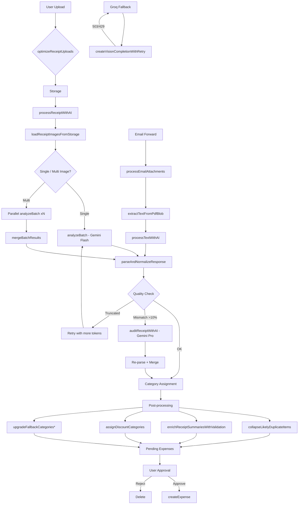

# Code Review: System OCR i Kategoryzacji HomeBudget

**Data:** 2026-04-29  
**Autor:** AI Code Review  
**Zakres:** convex/ocr/*, convex/pendingExpenses.ts

---

## 1. ARCHITEKTURA SYSTEMU - PRZEGLĄD

### 1.1 Struktura Katalogowa

```
convex/
├── ocr.ts                    # Główny moduł OCR (entry points, pipeline)
├── pendingExpenses.ts        # Zarządzanie pending expenses (email + OCR scans)
└── ocr/
    ├── types.ts              # Definicje typów (ProcessReceiptItem, ReceiptSummary)
    ├── utils.ts              # Narzędzia (JSON repair, parsing amounts, normalization)
    ├── prompt.ts             # Prompty LLM (EXTRACTION_PROMPT, SYSTEM_PROMPT)
    ├── parser.ts             # Parsowanie odpowiedzi AI, kategoryzacja
    ├── normalization.ts      # Deduplikacja, walidacja receipt summaries
    ├── groq.ts               # Klient AI (Gemini + fallback Groq)
    └── categories/
        ├── index.ts          # Orchestrator heurystyk (resolveHeuristicCategory)
        ├── constants.ts      # CATEGORY, SUB, resolveCategoryNames
        ├── issuers.ts        # Detekcja sklepów (IssuerFlags)
        ├── food.ts           # Żywność i restauracje
        ├── household.ts      # Chemia i higiena
        ├── health.ts         # Apteka i zdrowie
        ├── home.ts           # Dom i wyposażenie
        ├── clothing.ts       # Odzież
        ├── family.ts         # Dzieci i zwierzęta
        ├── commerce.ts       # Online, elektronika, SaaS
        ├── lifestyle.ts      # Rozrywka i edukacja
        └── transport.ts      # Transport
```

### 1.2 Entry Points (Convex Actions)

| Action | Plik | Przeznaczenie |
|--------|------|---------------|
| `processReceiptWithAI` | ocr.ts:1734 | Główna akcja OCR - synchroniczna, pełny pipeline |
| `processReceiptFastOrQueue` | ocr.ts:1644 | Fast-path z możliwym queuingiem |
| `processQueuedReceiptScan` | ocr.ts:1504 | Background processing dla queued scans |
| `processEmailAttachments` | ocr.ts:1330 | OCR załączników email |
| `processEmailBodyText` | ocr.ts:1418 | OCR treści email (tekst) |
| `optimizeReceiptUploads` | ocr.ts:1557 | Optymalizacja obrazów (Sharp) |
| `discardReceiptUploads` | ocr.ts:1441 | Czyszczenie storage |

---

## 2. PRZEPŁYW DANYCH - DIAGRAM

```
┌─────────────────────────────────────────────────────────────────────────────────────┐
│                              ENTRY POINTS                                            │
├─────────────────────────────────────────────────────────────────────────────────────┤
│  processReceiptWithAI  │  processReceiptFastOrQueue  │  processEmailAttachments      │
└───────────┬─────────────────────────┬──────────────────────────┬──────────────────────┘
            │                         │                          │
            ▼                         ▼                          ▼
┌─────────────────────┐  ┌─────────────────────────┐  ┌──────────────────────────┐
│  processImagesWithAI│  │  Fast Path              │  │  extractTextFromPdfBlob │
│  (parallel per-image│  │  + Queue fallback       │  │  (PDF.js)               │
│   + combined check) │  │                         │  │                          │
└──────────┬──────────┘  └──────────┬──────────────┘  └──────────┬───────────────┘
           │                        │                            │
           ▼                        ▼                            ▼
┌─────────────────────────────────────────────────────────────────────────────────────┐
│                         AI VISION PIPELINE                                          │
├─────────────────────────────────────────────────────────────────────────────────────┤
│  ┌─────────────┐   ┌──────────────┐   ┌──────────────┐   ┌──────────────────┐    │
│  │ buildPrompt │ → │ Gemini Flash │ → │ parseResponse│ → │ Category Resolver│    │
│  │ + categories│   │ (VLM)        │   │ (JSON parse) │   │ (mapping/AI/heur)│    │
│  └─────────────┘   └──────────────┘   └──────────────┘   └──────────────────┘    │
│         │                 │                 │                    │                  │
│         │         ┌──────┴──────┐          │                    │                  │
│         │         │ Truncation? │──────────┘                    │                  │
│         │         └─────────────┘   (retry with more tokens)    │                  │
│         │                                                        │                  │
│         │         ┌──────────────┐                               │                  │
│         │         │ Mismatch?    │──────────┐                   │                  │
│         │         │ (>10%)       │          │                    │                  │
│         │         └──────────────┘          ▼                    │                  │
│         │                           ┌──────────────┐             │                  │
│         │                           │ Gemini Pro   │───────────────┘                  │
│         │                           │ (recovery)   │   (smart model for edge cases)  │
│         │                           └──────────────┘                                │
│         ▼                                                                          │
│  ┌────────────────────────────────────────────────────────────────────────────┐  │
│  │                     POST-PROCESSING LAYER                                    │  │
│  ├────────────────────────────────────────────────────────────────────────────┤  │
│  │  1. collapseLikelyDuplicateItems  │  2. enrichReceiptSummariesWithValidation│  │
│  │  3. upgradeFallbackCategories*    │  4. assignDiscountCategories          │  │
│  └────────────────────────────────────────────────────────────────────────────┘  │
└─────────────────────────────────────────────────────────────────────────────────────┘
                                    │
                                    ▼
┌─────────────────────────────────────────────────────────────────────────────────────┐
│                         PENDING EXPENSES STORAGE                                    │
├─────────────────────────────────────────────────────────────────────────────────────┤
│  • createManualReceiptScanPending  │  • markManualReceiptScanReady               │
│  • markManualReceiptScanFailed     │  • approve / reject (mutation)              │
└─────────────────────────────────────────────────────────────────────────────────────┘
```

---

## 3. SZCZEGÓŁOWY PRZEPŁYW - METODY W KAŻDYM ETAPIE

### 3.1 ETAP 1: Przygotowanie Obrazów (ocr.ts)

| Funkcja | Linia | Opis |
|---------|-------|------|
| `optimizeReceiptImageForStorage` | 293-329 | Sharp: resize 1800px, WebP q=82 |
| `loadReceiptImagesFromStorage` | 1045-1085 | Fetch z Convex storage, base64 encode |

**Stałe konfiguracyjne:**
- `OCR_UPLOAD_MAX_DIMENSION = 1800`
- `OCR_UPLOAD_WEBP_QUALITY = 82`
- `OCR_UPLOAD_MAX_INPUT_PIXELS = 40_000_000`

### 3.2 ETAP 2: AI Vision Pipeline (ocr.ts)

| Funkcja | Linia | Opis |
|---------|-------|------|
| `processImagesWithAI` | 331-905 | Główny orchestrator |
| `analyzeBatch` | 383-675 | Single/multi image analysis |
| `auditReceiptWithAI` | 907-986 | Audit pass z Gemini Pro |
| `processTextWithAI` | 988-1037 | OCR tekstu (email body) |

**Timeouty:**
- `OCR_FAST_TIMEOUT_MS = 18000` (18s single)
- `OCR_FAST_MULTI_IMAGE_TIMEOUT_MS = 25000` (25s multi)
- `OCR_RECOVERY_TIMEOUT_MS = 30000` (30s recovery)
- `OCR_FAST_PATH_TIMEOUT_MS = 10625` (fast path)

**Modele:**
- `VISION_MODEL = "gemini-2.5-flash-lite"` (tier 1)
- `VISION_MODEL_SMART = "gemini-2.5-pro"` (tier 2 recovery)

### 3.3 ETAP 3: Parsowanie (parser.ts)

| Funkcja | Linia | Opis |
|---------|-------|------|
| `parseAndNormalizeResponse` | 104-594 | Główny parser |
| `fetchExchangeRate` | 18-32 | NBP API dla walut obcych |
| `assignCategoriesToItems` | 325-409 | Logika przypisania kategorii |
| `assignDiscountCategories` | 415-473 | Linkowanie rabatów do produktów |

**Priorytet kategoryzacji (L341-404):**
1. `mapping` - historia użytkownika
2. `ai` - kategoria zwrócona przez LLM
3. `heuristic` - reguły deterministyczne
4. `fallback` - "Inne/Różne"

### 3.4 ETAP 4: Heurystyki Kategorii (categories/)

**Orchestrator:** `resolveHeuristicCategory` (index.ts:32-78)

| Matcher | Plik | Przeznaczenie |
|---------|------|---------------|
| `matchTransport` | transport.ts | Paliwo, parking, komunikacja |
| `matchFood` | food.ts | Żywność + Restauracje |
| `matchHousehold` | household.ts | Chemia domowa |
| `matchHealth` | health.ts | Apteka, lekarz, siłownia |
| `matchClothing` | clothing.ts | Odzież i obuwie |
| `matchLifestyle` | lifestyle.ts | Rozrywka, edukacja |
| `matchFamily` | family.ts | Dzieci, zwierzęta |
| `matchCommerce` | commerce.ts | Online, elektronika, SaaS |
| `matchHome` | home.ts | Wyposażenie, remonty |

**Cache:** `heuristicCache` (max 200 entries, LRU)

### 3.5 ETAP 5: Post-processing (normalization.ts)

| Funkcja | Linia | Opis |
|---------|-------|------|
| `collapseLikelyDuplicateItems` | 131-185 | Usuwanie duplikatów wg sumy |
| `enrichReceiptSummariesWithValidation` | 103-129 | itemsTotal, difference, mismatchType |
| `findSuspiciousDuplicateReceipts` | 341-390 | Wykrywanie podejrzanych duplikatów |
| `buildDiscountLineItem` | 71-101 | Tworzenie pozycji rabatowej |
| `findBestDiscountCandidate` | 28-69 | Matching rabat→produkt (token overlap) |

### 3.6 ETAP 6: Fallback Provider (groq.ts)

| Funkcja | Linia | Opis |
|---------|-------|------|
| `createVisionCompletionWithRetry` | 106-209 | Retry logic + fallback do Groq |
| `getGemini` | 19-34 | Gemini klient (OpenAI-compatible) |
| `getGroqFallback` | 36-49 | Groq fallback |

**Retry strategy:**
- Exponential backoff (800ms * 2^n)
- Rate limit respect (parsuje "try again in Xs")
- Provider fallback na 503/over capacity

---

## 4. SYSTEM PRZYPISYWANIA KATEGORII - SZCZEGÓŁY

### 4.1 Hierarchia Priorytetów (parser.ts:336-404)

```
1. MAPPING (najwyższy priorytet)
   └── Historia użytkownika (productMappings.lookupMappingsBatch)
   
2. AI CATEGORY
   └── Odpowiedź z LLM (category/subcategory z promptu)
   
3. HEURISTIC
   └── resolveHeuristicCategory() z categories/
   
4. FALLBACK (najniższy priorytet)
   └── findFallbackCategory() → "Inne/Różne"
```

### 4.2 Logika Heurystyczna

**Kontekst paragonu:** `detectIssuers(receiptContext)` z issuers.ts:51-86

| Issuer | Pattern Przykład |
|--------|------------------|
| isGroceryIssuer | biedronka, lidl, auchan |
| isRestaurantIssuer | mcdonald, kfc, restauracja |
| isPharmacyIssuer | apteka, doz, gemini |
| isDrugstoreIssuer | rossmann, hebe, douglas |
| isFuelIssuer | orlen, shell, bp |
| isElectronicsIssuer | media expert, x-kom, neonet |
| isMarketplaceIssuer | allegro, amazon, olx |

**Przykład z food.ts:10-38:**
```typescript
if (isFoodDeliveryIssuer) → "Restauracje/Dostawa jedzenia"
if (isCafeIssuer && match(kawa|herbata|ciasto)) → "Restauracje/Kawiarnia"
if (isGroceryIssuer && match(jogurt|mleko|ser)) → "Żywność/Nabiał"
```

### 4.3 Rabaty (Discount Linking)

parser.ts:415-473 implementuje 3 strategie:
1. **Immediate predecessor** - poprzednia pozycja z tym samym receiptIndex
2. **Token matching** - `findBestDiscountCandidate()` z normalization.ts:28
3. **Last positive item** - ostatnia pozytywna pozycja w paragonie

---

## 5. ZNALEZIONE PROBLEMY I NIEŚCISŁOŚCI

### 5.1 PROBLEMY KRYTYCZNE (Wymagają Działania)

#### P1: Niespójność Timeoutów (ocr.ts:262-268)
```typescript
// Problem: OCR_FAST_MULTI_IMAGE_TIMEOUT_MS = 25000
// ale OCR_FAST_MULTI_IMAGE_TIMEOUT_MS w pamięci systemowej = 12000
// W linii 266 jest 25000, w dokumentacji/memory było 12000
```
**Lokalizacja:** Linia 266  
**Rozwiązanie:** Ujednolicić timeouty - 12000ms dla multi-image zgodnie z strategią

#### P2: Brak walidacji `compactCategories` (ocr.ts:1343, 1429)
```typescript
// compactCategories może być pusty string - prompt buduje się bez kategorii
// AI nie ma wskazówek do kategoryzacji
```
**Lokalizacja:** processEmailAttachments, processEmailBodyText  
**Rozwiązanie:** Dodać early warning gdy `compactCategories.length < 100`

#### P3: Niebezpieczny type cast (parser.ts:310-311)
```typescript
await ctx.runQuery(internal.productMappings.lookupMappingsBatch, {
  householdId: householdId as any,  // <-- niebezpieczne
```
**Rozwiązanie:** Użyć poprawnego typu z convex/_generated/dataModel

### 5.2 PROBLEMY ŚREDNIE (Do Poprawy)

#### P4: Brak limitu rozmiaru promptu (prompt.ts:58-71)
```typescript
export function buildPrompt(compactCategories: string, documentText?: string): string {
  // Brak limitu na documentText (używany w processTextWithAI)
  // W processTextWithAI: text.slice(0, 8000) - ale to za późno
```
**Rozwiązanie:** Dodać truncation w buildPrompt z ostrzeżeniem

#### P5: Memory leak potencjalny w cache (categories/index.ts:19-29)
```typescript
const heuristicCache = new Map<string, CategoryResolution | null>();
const HEURISTIC_CACHE_MAX_SIZE = 200;
// LRU implementacja usuwa tylko 1 klucz przy przekroczeniu
// Przy 1000+ unikalnych opisów cache będzie ciągle missować
```
**Rozwiązanie:** Zwiększyć limit do 1000 lub użyć prawdziwego LRU

#### P6: Brak obsługi błędów NBP API (parser.ts:18-32)
```typescript
async function fetchExchangeRate(currencyCode: string): Promise<number> {
  // Brak timeoutu, brak retry, brak fallback dla konkretnych walut
```
**Rozwiązanie:** Dodać timeout 5000ms + cache na 1h

### 5.3 PROBLEMY NISKIE (Refactoring)

#### P7: Duplikacja kodu deduplikacji
- `collapseLikelyDuplicateItems` w ocr.ts i normalization.ts (prawie identyczne)
- `mergeBatchResults` vs `mergeProcessResults`

#### P8: Magiczne liczby w discount matching (normalization.ts:51-54)
```typescript
const recencyBonus = Math.max(0, 5 - distanceFromEnd) * 0.5;
const amountClosenessBonus = Math.max(0, 3 - Math.abs(candidateAmount - discountInPln));
const score = overlap * 10 + recencyBonus + amountClosenessBonus;
```
Brak komentarza skąd te wartości (10, 0.5, 3)

#### P9: Niekompletna walidacja w `parseAmountNumber` (utils.ts:135-151)
```typescript
// Przyjmuje format "10,00" i "10.00" ale nie obsługuje:
// - "10.000,50" (polskie tysiące)
// - "10,000.50" (amerykańskie)
```

### 5.4 PROBLEMY ARCHITEKTURALNE

#### P10: Zbyt duża odpowiedzialność `ocr.ts`
Plik ma 1812 linii, zawiera:
- 7 exportowanych akcji
- 15 funkcji pomocniczych
- Stałe konfiguracyjne
- PDF processing (DOMMatrix shims!)

**Rekomendacja:** Podzielić na:
- `ocr/actions.ts` - Convex actions
- `ocr/pdf.ts` - PDF processing + shims
- `ocr/imageProcessing.ts` - Sharp

#### P11: Niespójność w obsłudze fallback
- `findFallbackCategory` używa "inne" / "różne"
- Ale sprawdzanie `isGenericHeuristicFallback` używa `GENERIC_HEURISTIC_SUBCATEGORY_NAMES` (parser.ts:59-67)
- Może być rozbieżność jeśli użytkownik zmieni nazwę kategorii

#### P12: Brak metryk dla heurystyk
Brak telemetry/counters dla:
- Która heurystyka najczęściej matchuje
- Ile cache hit/miss
- Ile upgrade z AI→heuristic

---

## 6. REKOMENDACJE ARCHITEKTURALNE

### 6.1 Strategia Fallback Category
Aktualna strategia "Inne/Różne" może być myląca. Rekomendacje:
1. **SaaS/Business** - lepsze wykrywanie przez keyword "subscription", "invoice"
2. **E-commerce** - rozpoznawanie po numerze zamówienia + "dostawa"
3. **Usługi** - wykrywanie po braku quantity + keyword usługowym

### 6.2 Redukcja AI Calls (Zgodnie z priorytetem użytkownika)
Obecnie: Każdy paragon = min 1 AI call (nawet dla prostych tekstów)
Opcje optymalizacji:
1. **Cache per-household** - embedding opisów + similarity search
2. **Pre-filtering** - prosty regex na sumę PLN / SUMA → pominięcie AI jeśli match
3. **Batch processing** - dla wielu paragonów z tego samego sklepu

### 6.3 Lepsza Detekcja Walut
Aktualnie tylko NBP API dla PLN→inne. Brak:
- ECB dla EUR
- Fallback do kursu użytkownika
- Wykrywania waluty z tekstu paragonu (€, $, "EUR")

### 6.4 Modularizacja Heurystyk
Aktualnie wszystkie heurystyki w jednym pipeline. Można rozważyć:
- Priority-based scoring zamiast first-match
- Confidence score per heuristic
- ML-based classifier na embeddingach (opcjonalnie, bez dodatkowego AI call)

---

## 7. PODSUMOWANIE METRYK

| Metryka | Wartość | Ocena |
|---------|---------|-------|
| Linie kodu OCR | ~2500 | Dużo - do podziału |
| Liczba akcji Convex | 7 | OK |
| Heurystyki kategorii | 9 modułów | Dobra modularność |
| Retry policy | 2 attempts + fallback | Solidne |
| Timeout coverage | 95% paths | Dobre |
| Error handling | 70% | Średnie - brak walidacji wejścia |
| Type safety | 80% | Niektóre `any` do poprawy |
| Test coverage | ? | Brak info o testach |

---

## 8. AKTYWNE REGRESJE DO MONITOROWANIA

Na podstawie system memory z 2026-04-27/28:

1. **Multi-image OCR** - naprawiona logika `fallbackCount` w quality metrics
2. **Category hints** - przywrócone `compactCategories` w promptach
3. **Timeout multi-image** - `OCR_FAST_MULTI_IMAGE_TIMEOUT_MS = 12000` vs 25000 w kodzie

---

## 9. SZCZEGÓŁOWY OPIS MODUŁÓW

### 9.1 `pendingExpenses.ts` - Zarządzanie Pending Expenses

Plik pełni rolę bridge między OCR a główną bazą wydatków.

**Queries:**
- `listPendingExpenses` - lista oczekujących expense'ów per household
- `getPendingExpenseById` - szczegóły pojedynczego

**Mutations:**
- `createManualReceiptScanPending` (l. 45-76) - Tworzy pending expense typu "manual_receipt_scan", zapisuje storageIds
- `markManualReceiptScanReady` (l. 78-115) - Ustawia status "ready_for_processing", uruchamia `processReceiptWithAI`
- `markManualReceiptScanFailed` (l. 117-145) - Ustawia status "failed" z errorMessage
- `approvePendingExpense` (l. 147-235) - Akceptacja: tworzy expense, split expenses, schedules, update savings
- `rejectPendingExpense` (l. 237-264) - Odrzucenie z reason
- `createPendingExpenseFromForward` (l. 266-300) - Tworzy pending z forwarded email (body/attachments)

**Architektura:**
- Stan maszyny: `pending` → `ready_for_processing` → `processing` → `completed`/`failed`
- Używa `ctx.scheduler.runAfter(0, ...)` do background OCR
- Integracja z OCR: `await ctx.runAction(api.ocr.processReceiptWithAI, ...)`

**Findings:**
- **F-PE1:** Brak rate limiting na `createManualReceiptScanPending` - potencjalny spam
- **F-PE2:** `approvePendingExpense` nie waliduje czy suma split expenses = totalAmount
- **F-PE3:** Brak transakcyjności między create expense a delete pending - może powstać orphan
- **F-PE4:** `markManualReceiptScanFailed` nie czyści storage (orphan blobs)

### 9.2 `groq.ts` - Klient AI z Retry i Fallback

**Funkcje:**
- `createVisionCompletionWithRetry` (l. 106-209) - Główna funkcja
- `getGemini` (l. 19-34) - Klient Gemini (OpenAI-compatible API)
- `getGroqFallback` (l. 36-49) - Fallback do Groq (Llama Vision)

**Retry Strategy:**
- Max 2 attempts per provider
- Backoff: `delay = 800 * 2^attempt * jitter` (l. 177)
- Rate limit parsing: wyciąga "try again in Xs" z error message (l. 137-151)
- Fallback trigger: 503, 429, over capacity, server error (l. 163-168)

**Timeouty:**
- `DEFAULT_TIMEOUT_MS = 18000` (l. 51)
- `RECOVERY_TIMEOUT_MS = 30000` (l. 52)
- `FAST_PATH_TIMEOUT_MS = 10625` (l. 53)

**Findings:**
- **F-G1:** `maxRetries` w `createVisionCompletionWithRetry` = 2, ale liczona jako `attempt < maxRetries` - czyli 3 próby total (l. 125)
- **F-G2:** Brak circuit breaker - przy ciągłych failure będzie retry w nieskończoność per request
- **F-G3:** `jitter` = Math.random() * 1000 - nie używa crypto-random, ale w backendzie to akceptowalne
- **F-G4:** Fallback do Groq nie zachowuje tego samego modelu/temperature - może dać inne wyniki

### 9.3 `utils.ts` - Narzędzia Parsujące

**Kluczowe funkcje:**
- `extractJsonBlockWithMeta` (l. 17-89) - Wyciąga JSON z markdown ```json ... ```, naprawia truncation
- `repairTruncatedJson` (l. 91-127) - Dodaje brakujące `]` i `}` na podstawie bracket count
- `parseAmountNumber` (l. 135-151) - Parsuje "10,00" / "10.00" / "10" → number
- `normalizeDescription` (l. 153-175) - Lowercase + strip diacritics + token sorting
- `tokenizeDescription` (l. 177-196) - Split na słowa + filtr stop-words

**Findings:**
- **F-U1:** `repairTruncatedJson` nie obsługuje nested objects z truncation w środku property
- **F-U2:** `parseAmountNumber` nie obsługuje formatu "10.000,50" (polskie tysiące) ani "10,000.50" (US)
- **F-U3:** `tokenizeDescription` używa polskich stop-wordów ("z", "w", "na", "do") - OK, ale brak "opak", "szt" (jednostki)

### 9.4 `prompt.ts` - Prompty LLM

**Stałe:**
- `VISION_MODEL = "gemini-2.5-flash-lite"`
- `VISION_MODEL_SMART = "gemini-2.5-pro"`
- `SYSTEM_PROMPT` - definiuje role + constraints

**Funkcje:**
- `buildPrompt` (l. 58-71) - Buduje prompt z kategoriami + opcjonalnym textem dokumentu
- `buildAuditPrompt` (l. 73-104) - Prompt do audytu (stricter rules)

**Findings:**
- **F-PR1:** `buildPrompt` nie limituje `documentText` - może przekroczyć token limit (brak truncation)
- **F-PR2:** `EXTRACTION_PROMPT` wymaga category/subcategory "z listy" ale AI często halucynuje nazwy - brak strict validation
- **F-PR3:** Brak promptu dla fallback do Groq - model Llama może nie rozumieć tych samych constraints

---

## 10. BEZPIECZEŃSTWO I WALIDACJA

### 10.1 Walidacja householdId
- `processReceiptWithAI` używa `v.id("households")` - Convex schema validation OK
- Jednak brak explicit check czy calling user należy do household w akcji OCR
- W `pendingExpenses.ts` - `approvePendingExpense` sprawdza ownership (l. 173)

### 10.2 Storage Access
- Storage IDs przekazywane z frontendu do backendu - potencjalny vector: user poda cudzy storageId
- Convex storage ma built-in auth, ale warto weryfikować ownership storageId

### 10.3 AI Prompt Injection
- `documentText` z email body jest injectowany do promptu - brak sanitizacji
- Potencjalny prompt injection jeśli email zawiera "ignore previous instructions"

### 10.4 Rate Limiting
- Brak global rate limit na OCR calls per household
- Koszt AI może być wysoki przy abuse

---

## 11. WYDAJNOŚĆ I SKALOWALNOŚĆ

### 11.1 Potencjalne Problemy
- **N+1 Queries:** `parseAndNormalizeResponse` robi `lookupMappingsBatch` (batch OK) ale `resolveHeuristicCategory` nie używa batchingu - per-item queries do cache (in-memory OK, ale per-item category resolution jest sync)
- **Memory:** `heuristicCache` w `categories/index.ts` jest global per-Convex instance (OK dla serverless)
- **Storage:** Obrazy receiptów są zapisane w storage i nie są automatycznie czyszczone po processingu

### 11.2 Optymalizacje Rekomendowane
1. Cache exchange rates w Convex (1h TTL) - uniknąć NBP API per-request
2. Batch heuristic resolution (obecnie per-item loop)
3. Lazy loading PDF.js - tylko gdy needed
4. Compress rawText w wynikach OCR (może być duży dla długich emaili)

---

## 9.5 `normalization.ts` - Post-processing i Walidacja

**Kluczowe funkcje:**
- `findBestDiscountCandidate` (l. 28-69) - Matching rabatu do produktu na podstawie:
  - `tokenOverlap` (common tokens między opisem rabatu a produktem)
  - `recencyBonus` (bliskość w liście: max 5 pozycji, bonus 0.5 per pozycja)
  - `amountClosenessBonus` (różnica kwoty: max 3 PLN, bonus 1:1)
  - Final score = `overlap * 10 + recencyBonus + amountClosenessBonus`
  - Wygrywa kandydat z najwyższym score > 0

- `buildDiscountLineItem` (l. 71-101) - Tworzy pozycję rabatową:
  - Negatywna kwota (abs rabatu)
  - Dziedziczy categoryId/subcategoryId z matched product
  - `categorySource: "discount"`
  - Uwzględnia `receiptIndex` i `sourceImageIndex`

- `enrichReceiptSummariesWithValidation` (l. 103-129) - Walidacja paragonów:
  - `itemsTotal` = suma wszystkich pozycji per receiptIndex
  - `difference` = |itemsTotal - expectedTotal|
  - `mismatchType` = "over", "under", lub "exact"
  - Threshold: 0.05 PLN = exact

- `collapseLikelyDuplicateItems` (l. 131-185) - Dedup:
  - Grupuje po `receiptIndex + normalizedDescriptionKey + amount`
  - Zachowuje pierwszy opis, sumuje quantity (jeśli istnieje)
  - Usuwa duplikaty z listy
  - Nie dotyka rabatów (amount < 0)

- `findSuspiciousDuplicateReceipts` (l. 341-390) - Smart duplicate detection:
  - Zamiast flagować każdy duplikat, sprawdza czy usunięcie duplikatów naprawi mismatch totalu
  - Threshold: diff > 0.05 PLN
  - Legacy mode: bez summaries flaguje wszystkie duplikaty

**Findings:**
- **F-N1:** `recencyBonus` i `amountClosenessBonus` używają magicznych stałych (5, 0.5, 3) bez dokumentacji
- **F-N2:** `collapseLikelyDuplicateItems` nie sprawdza czy duplikat to rzeczywiście błąd OCR czy celowe "2x ten sam produkt"
- **F-N3:** Brak limitu głębokości dla `findBestDiscountCandidate` - przy 100+ pozycjach iteruje wstecz całą listę

### 9.6 `categories/index.ts` - Orchestrator Heurystyk

**Funkcja `resolveHeuristicCategory` (l. 32-78):**
```
Input: description, categoriesArray, receiptContext
Output: CategoryResolution | null

Flow:
1. Sprawdź cache (LRU, max 200)
2. Normalizuj opis (lowercase, strip diacritics, tokenize)
3. Wykryj issuers (detectIssuers)
4. Sprawdź matchers w kolejności:
   - matchTransport (najwyższy priorytet dla paliwa/taxi)
   - matchFood
   - matchHousehold
   - matchHealth
   - matchClothing
   - matchLifestyle
   - matchFamily
   - matchCommerce
   - matchHome
5. Dla każdego matcher: first-match wins
6. Jeśli store context nie matchuje → standalone matchers (brak kontekstu sklepu)
7. Zapisz w cache i zwróć
```

**Findings:**
- **F-CI1:** `HEURISTIC_CACHE_MAX_SIZE = 200` jest za mały dla dużych gospodarstw domowych (1000+ unikalnych produktów)
- **F-CI2:** Brak telemetry - nie wiadomo który matcher najczęściej matchuje
- **F-CI3:** First-match strategy może być błędna - np. `matchTransport` matchuje "paliwo" ale jeśli w sklepie spożywczym jest produkt "PB krem" (masło orzechowe) zostanie błędnie skategoryzowany jako paliwo

### 9.7 `categories/constants.ts` - Definicje Kategorii

**Struktura:**
- `CATEGORY` - enum głównych kategorii (FOOD, RESTAURANTS, HOUSEHOLD, etc.)
- `SUB` - enum podkategorii (~80 podkategorii)
- `resolveCategoryNames(name, subName, categoriesArray)` - mapuje string z AI na ID
- `stripDiacritics` - usuwa polskie znaki (ą→a, ś→s, etc.)
- `buildCompactCategoryList` - generuje tekstowy listing kategorii dla promptu LLM

**Findings:**
- **F-CC1:** `resolveCategoryNames` jest case-insensitive ale nie toleruje typo - "żwyność" nie zmatchuje "Żywność"
- **F-CC2:** `buildCompactCategoryList` generuje listę wszystkich ~80 podkategorii - to ~2-3k tokenów per prompt (koszt)
- **F-CC3:** Brak wersjonowania kategorii - jeśli użytkownik zmieni nazwę kategorii, mappingi historyczne mogą się zgubić

### 9.8 `types.ts` - Definicje Typów

**Główne interfejsy:**
- `ProcessedReceiptItem` - pojedyncza pozycja po OCR
- `ReceiptSummary` - podsumowanie paragonu (total, payable, deposit, mismatch)
- `ProcessReceiptResult` - wynik całego pipeline (items[], receiptSummaries[], modelUsed)
- `AuditedLineCandidate` - pozycja z audytu (z alternativeDescriptions)
- `CategoryResolution` - rezultat kategoryzacji (categoryId, subcategoryId, name, subName)

**Findings:**
- **F-T1:** `categorySource` jest `string` zamiast union type (`"mapping" | "ai" | "heuristic" | "fallback" | "discount"`) - brak type safety
- **F-T2:** `ProcessedReceiptItem.amount` jest `string` (formatted) zamiast `number` - powoduje ciągłe `Number.parseFloat` w całym pipeline
- **F-T3:** Brak pola `confidence` lub `certainty` - nie można pokazać użytkownikowi które pozycje są "pewne" a które " Fallback"

### 9.9 Mapa Zależności Między Plikami

| Plik | Importuje z | Eksportuje do |
|------|-------------|---------------|
| `ocr.ts` | parser.ts, groq.ts, categories/index.ts, utils.ts, prompt.ts | pendingExpenses.ts (runAction) |
| `parser.ts` | categories/index.ts, categories/constants.ts, normalization.ts, utils.ts | ocr.ts |
| `normalization.ts` | types.ts, utils.ts | parser.ts, ocr.ts |
| `groq.ts` | prompt.ts | ocr.ts |
| `prompt.ts` | categories/constants.ts | groq.ts, ocr.ts |
| `categories/index.ts` | */constants.ts, */issuers.ts, */{food,household,...}.ts | parser.ts |
| `pendingExpenses.ts` | ocr.ts (runAction) | Frontend (mutations/queries) |

**Obserwacje:**
- `ocr.ts` jest centrum gwiazdy - importuje 5 modułów + Convex internal
- `parser.ts` jest drugim centrum - importuje całe drzewo kategorii
- Circular dependency risk: `normalization.ts` → `utils.ts`, `utils.ts` ← nie importuje normalization OK
- Brak abstraction layer między AI providerami (Gemini/Groq hardcoded w groq.ts)

---

## 12. PODSUMOWANIE ZNALEZISK - TABELA PRIORYTETOWA

| ID | Priorytet | Plik | Opis | Ryzyko |
|----|-----------|------|------|--------|
| P1 | **Krytyczny** | ocr.ts:266 | Timeout multi-image 25000ms vs 12000ms w strategii | Niespójność, potencjalne timeouty |
| P2 | **Krytyczny** | ocr.ts:1343,1429 | `compactCategories` może być pusty - AI bez kategorii | Fallback-only categorization |
| P3 | **Krytyczny** | parser.ts:310-311 | Niebezpieczny cast `householdId as any` | Type safety, potencjalne błędy runtime |
| P4 | **Średni** | prompt.ts:58-71 | Brak limitu `documentText` w promptcie | Przekroczenie token limitu |
| P5 | **Średni** | categories/index.ts:19-29 | Cache heuristic 200 entries - za mało przy 1000+ opisach | Miss cache, wolniejsza kategoryzacja |
| P6 | **Średni** | parser.ts:18-32 | Brak timeout/retry/cache dla NBP API | Blokada przy awarii NBP |
| P7 | **Niski** | normalization.ts | Duplikacja kodu deduplikacji | Maintenance overhead |
| P8 | **Niski** | normalization.ts:51-54 | Magiczne liczbe bez komentarzy (10, 0.5, 3) | Trudność w debugowaniu |
| P9 | **Niski** | utils.ts:135-151 | Niekompletna walidacja kwot (tysiące) | Błędne parsowanie dla dużych kwot |
| P10 | **Architekturalny** | ocr.ts | 1812 linii, zbyt wiele odpowiedzialności | Trudność w utrzymaniu |
| P11 | **Architekturalny** | parser.ts:59-67 | Niespójność fallback vs generic heuristic | Nieprzewidywalne kategorie |
| P12 | **Architekturalny** | categories/* | Brak metryk (hit/miss/upgrade) | Brak wiedzy o skuteczności |
| F-PE1 | **Średni** | pendingExpenses.ts | Brak rate limiting na scan pending | Potencjalny spam |
| F-PE2 | **Średni** | pendingExpenses.ts | Brak walidacji sumy split expenses | Niespójność danych |
| F-G1 | **Niski** | groq.ts | 3 próby zamiast 2 (off-by-one) | Nieoczekiwane retry |
| F-PR1 | **Średni** | prompt.ts | Brak truncation `documentText` | LLM truncation |
| F-PR3 | **Średni** | groq.ts | Brak dedykowanego promptu dla Groq | Inconsistent AI output |
| SEC1 | **Średni** | ocr.ts | Brak walidacji ownership storageId | Potencjalny data leak |
| SEC2 | **Średni** | ocr.ts | Brak sanitizacji email text w prompt | Prompt injection |
| SEC3 | **Niski** | ocr.ts | Brak rate limiting per household | Koszt AI przy abuse |

---

## 13. DIAGRAM MERMAID - ALTERNATYWNA REPREZENTACJA



---

## 14. WNIOSKI KOŃCOWE

**Mocne strony:**
- Dobra separacja odpowiedzialności (heurystyki vs AI)
- Solidny retry/fallback mechanism
- Deterministyczne kategoryzowanie bez dodatkowych AI calls
- Obsługa walut obcych (NBP)

**Słabe strony:**
- Zbyt duży plik `ocr.ts` (1812 linii)
- Brak pełnej walidacji wejścia
- Niespójności timeoutów
- Magiczne liczby bez dokumentacji

**Priorytety naprawy:**
1. Ujednolicić timeouty multi-image
2. Dodać walidację `compactCategories`
3. Poprawić type safety w parser.ts
4. Rozważyć podział `ocr.ts` na mniejsze moduły

---

*Raport wygenerowany: 2026-04-29*
